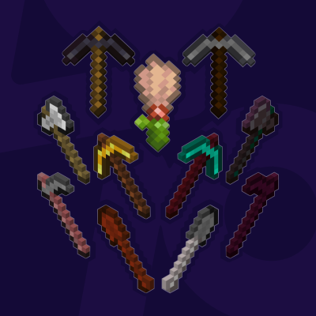

#  More Tool Variants
> 
>
> A simple mod adding wood variants for Minecraft's Tool Items (Pickaxe, Axe, Shovel, Hoe, Brush).

### Compatibility

- Minecraft: `1.20.1`, `1.21(.1)`, `1.21.4`~`1.21.10`
- Mod Loader: _Fabric_
- Requires: [`Fabric API`](https://modrinth.com/mod/fabric-api), [ `More Stick Variants (MStV)`](https://modrinth.com/mod/more-stick-variants)

### ᴬ⃯ ᵦ⃔ Translations

Currently available in:
- English
- German

Want to help translate? Feel free to open a PR to the **default branch (`1.21(.1)`)**.

### Changelog History

<!--CHANGELOG:START-->
## 1.2.0:
- `1.21.9(10)`: Add _**Copper** Pickaxe, Axe, Shovel and Hoe_ Variants
### 1.1.3:
- `1.21.5`: Update to 1.21.5
### 1.1.2:
- Re-add vanilla pickaxes to "**Getting an Upgrade**" and "**Isn't It Iron Pick**"
- Add "**Serious Dedication**" advancement 
- `1.20.1`: Fix newly added advancements
### 1.1.1:
- Add missing advancements ("**Getting an Upgrade**", "**Isn't It Iron Pick**" and "**Oh Shiny**")
- Decrease texture file size by ~45%
- Add relevant c_tags for better mod incompatibility
## 1.1.0:
- `1.21.3`, `1.21.4`: Add _**Pale Oak** Tools_ of every kind
### 1.0.3:
- `1.21.4`: Update to 1.21.4
- _**Deepslate** Tool Variants_ are now correctly crafted using Cobbled Deepslate instead of regular Deepslate as it has been intended from the start
### 1.0.2:
- `1.21.2`, `1.21.3`: Update to 1.21.2, 1.21.3
- Fix shovels not being correctly tagged as such which made e.g. enchanting them in `1.20.5⁺` impossible
### 1.0.1:
- Add tags for each tool type
- `1.20.6`, `1.21(.1)`: Fix tool variants not being enchantable
<!--CHANGELOG:END-->

> _`The section above is automatically updated with each new release and only includes already published releases.`_
---
#### Support/Contact
- Suggestions? Questions? Bug reports?  
  Feel free to [open an issue](/../../issues)!  
  &nbsp;  
  You can also contact me via email at [contact@pnku.de](mailto:contact@pnku.de) or join the [Discord](https://dsc.lieonlion.dev) and contact me there.
